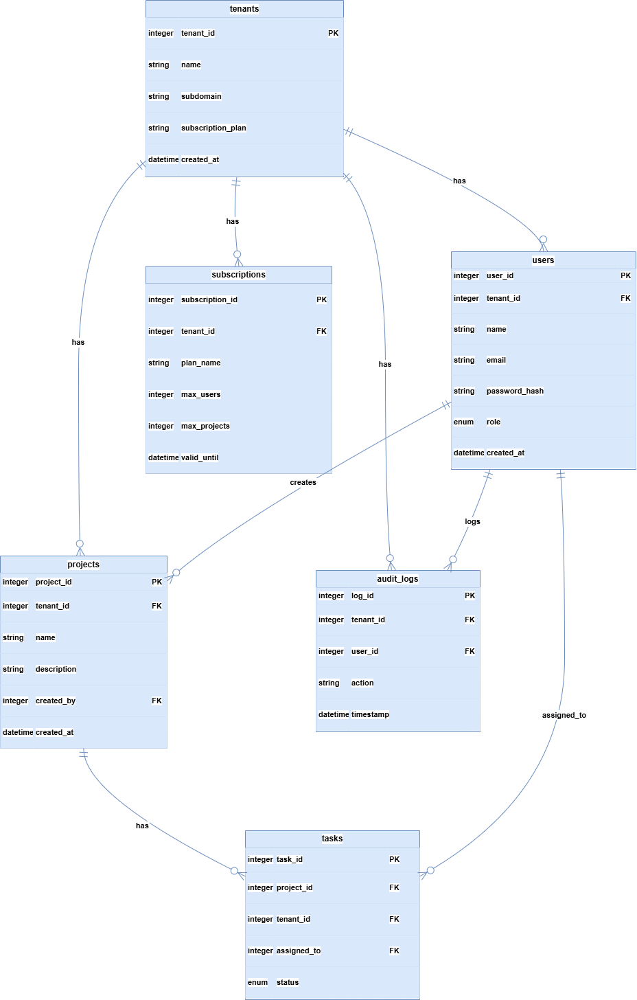

# System Architecture Document

## 1. System Architecture Overview

The system follows a three-tier architecture consisting of a **client layer**, **application layer**, and **data layer**. The client layer is implemented using a React-based frontend that interacts with the backend through RESTful APIs. The application layer is built using Node.js and Express, which handles authentication, authorization, business logic, tenant isolation, and subscription enforcement. The data layer uses PostgreSQL to store tenant, user, project, and task data with strong relational constraints.

All components are containerized using Docker and orchestrated with Docker Compose. This setup ensures consistent environments across development and evaluation. The frontend communicates with the backend over HTTP, while the backend communicates with the database using a private Docker network. Tenant isolation is enforced by extracting tenant information from JWT tokens and applying it to all database queries.

---

## 2. System Architecture Diagram

The system architecture follows a three-tier design deployed within a Docker Compose environment.

- The **client (browser)** interacts with the **React frontend**
- The **frontend** communicates with the **backend API** via `/api/*` endpoints
- The **backend** handles authentication, authorization, tenant isolation, and business logic
- The **PostgreSQL database** stores all persistent data

JWT-based authentication secures API access. After login, a JWT token is issued and included in the `Authorization` header for all protected API requests. Tenant isolation is enforced by extracting the `tenant_id` from the JWT token and applying it to all database queries.

The entire system is containerized using Docker Compose, ensuring simplified deployment and consistent service communication.

---

## 3. Database Schema Design (ERD)

The database schema is designed to support a **multi-tenant SaaS architecture** using a **shared database and shared schema** approach. PostgreSQL is used to ensure strong data integrity, transactional safety, and relational consistency.

Core entities include **Tenants**, **Users**, **Projects**, **Tasks**, and **Audit Logs**. Each tenant-specific entity contains a `tenant_id` field to enforce logical data isolation.

### Key Entities and Relationships

- **Tenants**: Represents organizations using the platform
- **Users**: Belong to a tenant and have roles such as `super_admin`, `tenant_admin`, or `user`
- **Projects**: Created within a tenant and owned by users
- **Tasks**: Belong to projects and can be assigned to users within the same tenant
- **Audit Logs**: Track all important actions for security and compliance

Foreign key relationships and cascade rules are applied where appropriate. Indexes are created on `tenant_id`, `project_id`, and other frequently queried fields to ensure performance at scale.

This schema enforces strict tenant isolation while allowing efficient scaling within a single database.

---

## 4. API Architecture

The application follows a **RESTful API architecture** implemented using Node.js and Express. All APIs are prefixed with `/api` and return consistent JSON responses.

### API Layers

- **Routing Layer** – Defines REST endpoints and HTTP methods
- **Middleware Layer** – Handles JWT authentication, RBAC, tenant isolation, and validation
- **Controller Layer** – Processes requests and prepares responses
- **Service Layer** – Contains business logic and subscription checks
- **Data Access Layer** – Executes tenant-aware database queries

### Authentication & Authorization

JWT-based authentication is used for stateless access control. Each JWT token contains:
- `userId`
- `tenantId` (null for super_admin)
- `role`

Role-based access control (RBAC) ensures that users can only perform actions permitted by their role. Tenant isolation is enforced by filtering all queries using the `tenant_id` derived from the JWT token.

---

## 5. API Endpoint Overview (MANDATORY – 19 APIs)

### Authentication APIs
- `POST /api/auth/register-tenant` – Register a new tenant and tenant admin
- `POST /api/auth/login` – Authenticate user and issue JWT
- `GET /api/auth/me` – Get current authenticated user
- `POST /api/auth/logout` – Logout user

### Tenant Management APIs
- `GET /api/tenants/{tenantId}` – Get tenant details
- `PUT /api/tenants/{tenantId}` – Update tenant details
- `GET /api/tenants` – List all tenants (super_admin only)

### User Management APIs
- `POST /api/tenants/{tenantId}/users` – Add user to tenant
- `GET /api/tenants/{tenantId}/users` – List tenant users
- `PUT /api/users/{userId}` – Update user details
- `DELETE /api/users/{userId}` – Delete user

### Project Management APIs
- `POST /api/projects` – Create project
- `GET /api/projects` – List projects
- `PUT /api/projects/{projectId}` – Update project
- `DELETE /api/projects/{projectId}` – Delete project

### Task Management APIs
- `POST /api/projects/{projectId}/tasks` – Create task
- `GET /api/projects/{projectId}/tasks` – List project tasks
- `PATCH /api/tasks/{taskId}/status` – Update task status
- `PUT /api/tasks/{taskId}` – Update task details

---

## 6. Security Considerations

- All protected APIs require a valid JWT token
- Role-based permissions restrict sensitive operations
- Tenant-level data access is enforced at the query level
- Input validation prevents malformed or malicious requests
- Centralized error handling avoids information leakage
- Audit logs record all critical create, update, and delete actions

This architecture ensures **scalability**, **maintainability**, and **strict tenant isolation**, meeting all requirements for a production-ready multi-tenant SaaS platform.
