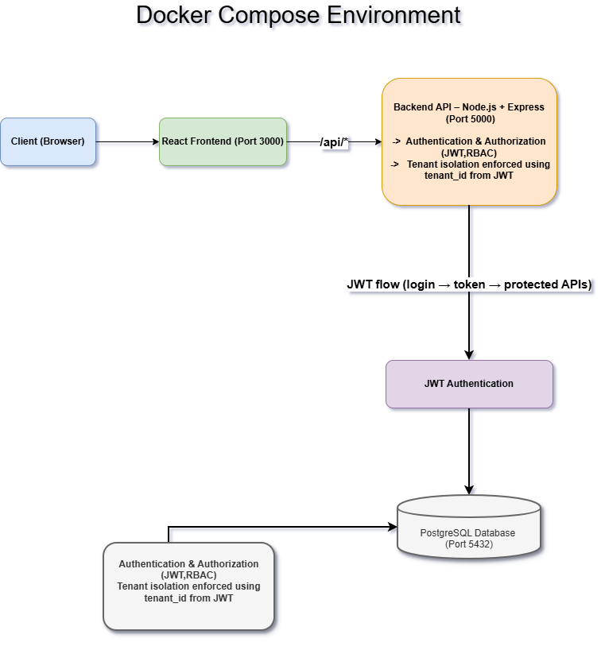
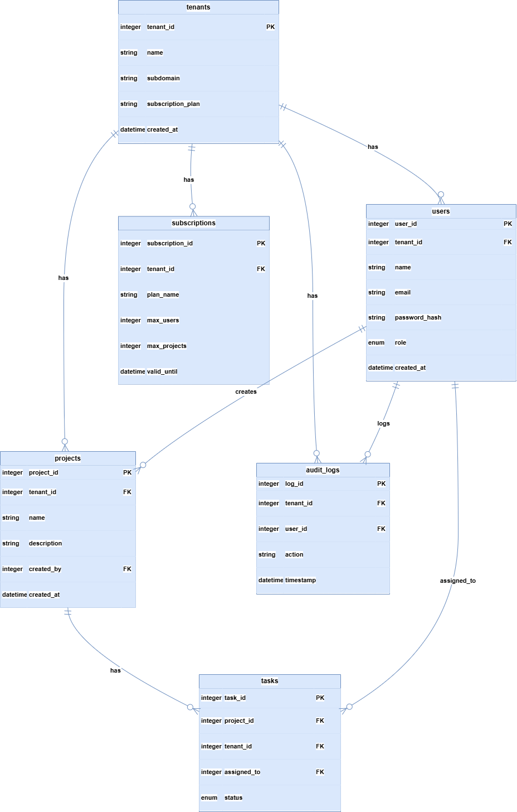

# System Architecture Document

## 1. System Architecture Overview
The system follows a three-tier architecture consisting of a client layer, application layer, and data layer. The client layer is implemented using a React-based frontend that interacts with the backend through RESTful APIs. The application layer is built using Node.js and Express, which handles authentication, authorization, business logic, and tenant isolation. The data layer uses PostgreSQL to store tenant, user, project, and task data with strict relational constraints.

All components are containerized using Docker and orchestrated with Docker Compose. This setup ensures consistent environments across development and evaluation. The frontend communicates with the backend using secure HTTP requests, while the backend communicates with the database using a private Docker network. Tenant isolation is enforced by extracting tenant information from JWT tokens and applying it to all database queries.

## 2. System Architecture Diagram

The system architecture follows a three-tier design deployed within a Docker Compose environment. The client interacts with the React-based frontend through a web browser. The frontend communicates with the backend API using RESTful HTTP requests under the `/api/*` path. The backend, implemented using Node.js and Express, handles authentication, authorization, business logic, and tenant isolation. All backend services communicate with the PostgreSQL database over a private Docker network.

JWT-based authentication is used to secure API access. Upon successful login, a JWT token is issued to the client and included in subsequent requests to access protected endpoints. Tenant isolation is enforced at the backend by extracting the tenant identifier from the JWT token and applying it to all database queries.

The complete system is containerized using Docker Compose, which ensures consistent environments, simplified deployment, and isolated service communication.

## 3. Database Schema Design (ERD)

The database schema is designed to support a multi-tenant SaaS architecture using a shared database and shared schema approach. PostgreSQL is used as the relational database to ensure data integrity, consistency, and strong relational constraints.

The core entities in the database include Organizations (Tenants), Users, Projects, and Tasks. Each entity is associated with a tenant through a `tenant_id` field to enforce logical data isolation between organizations.

### Key Entities and Relationships:
- **Organizations**: Represents tenant organizations using the platform.
- **Users**: Belong to a single organization and have assigned roles such as Admin, Manager, or User.
- **Projects**: Created within an organization and owned by a tenant.
- **Tasks**: Belong to a project and can be assigned to users within the same tenant.

Foreign key relationships are enforced between users, projects, and tasks to maintain referential integrity. Cascading rules are applied where appropriate to ensure that dependent records are handled correctly during deletion operations.

Indexes are applied on frequently queried fields such as `tenant_id`, `user_id`, and `project_id` to optimize query performance. This schema design ensures scalability, security, and efficient data access while maintaining strict tenant isolation.
The ERD reflects a shared-database, shared-schema multi-tenancy approach, where logical isolation is enforced using tenant identifiers rather than physical database separation.

## 4. API Architecture

The application follows a RESTful API architecture implemented using Node.js and Express. All APIs are prefixed with `/api` to clearly separate backend services from frontend routes. The API layer is responsible for handling authentication, authorization, tenant isolation, and core business logic.

### API Layers
- **Routing Layer**: Defines REST endpoints and HTTP methods.
- **Middleware Layer**: Handles JWT authentication, role-based access control (RBAC), tenant isolation, and request validation.
- **Controller Layer**: Processes incoming requests and returns appropriate responses.
- **Service Layer**: Contains business logic related to users, projects, tasks, and subscriptions.
- **Data Access Layer**: Communicates with the PostgreSQL database using tenant-aware queries.

### Authentication & Authorization
JWT-based authentication is used to secure API access. Upon successful login, a JWT token is issued and must be included in the `Authorization` header for all protected endpoints. Role-based access control ensures that only authorized users can perform specific actions.

Tenant isolation is enforced by extracting the `tenant_id` from the JWT token and applying it to all database queries.

### API Endpoint Overview

#### Authentication APIs
- `POST /api/auth/register` – Register a new tenant and admin user  
- `POST /api/auth/login` – Authenticate user and issue JWT  
- `POST /api/auth/logout` – Invalidate user session  

#### User Management APIs
- `GET /api/users` – List users within a tenant  
- `POST /api/users` – Create a new user  
- `PUT /api/users/{id}` – Update user details  
- `DELETE /api/users/{id}` – Remove a user  

#### Project Management APIs
- `GET /api/projects` – List projects for a tenant  
- `POST /api/projects` – Create a new project  
- `PUT /api/projects/{id}` – Update project details  
- `DELETE /api/projects/{id}` – Delete a project  

#### Task Management APIs
- `GET /api/projects/{projectId}/tasks` – List tasks in a project  
- `POST /api/projects/{projectId}/tasks` – Create a task  
- `PUT /api/tasks/{id}` – Update task status or assignment  
- `DELETE /api/tasks/{id}` – Delete a task  

### Security Considerations
- All protected APIs require a valid JWT token.
- Role-based permissions restrict access to sensitive operations.
- Tenant-level data access is enforced at the database query level.
- Input validation and centralized error handling are applied to all requests.

This API architecture ensures scalability, maintainability, and secure access to tenant-specific resources.
All API responses follow a consistent JSON structure with standardized success and error formats to simplify frontend integration.